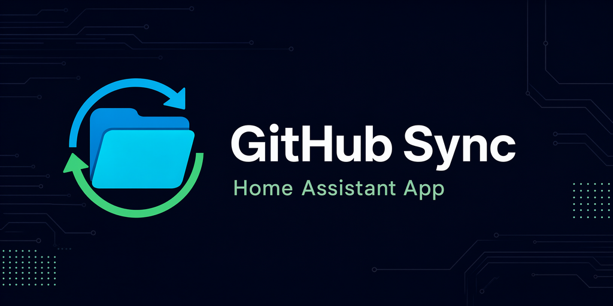

# GitHub Sync

[](https://github.com/sandro-defender/Github-Sync/releases)

<p align="center"></p>

**Home Assistant App** (formerly add-on) that syncs **any folder** Home Assistant can see — `/config`, `/share`, `/media`, backups, add-on configs — with a GitHub repository.

Each folder can point at a **different repo and branch**. After install, **GitHub Sync** appears in the sidebar (admin users) with a file browser, a folder-tree editor for the `.gitignore` rules where every file and folder can be ticked, and **Check for updates / Upload / Download**.

This is not a HACS integration and not a git client on the host. The app runs in its own Supervisor container and talks to GitHub over the REST **Git Data API**.

Requires **Home Assistant OS** or **Supervised**. Container and Core installs do not have Apps.

## Features

- Connect one GitHub account with selected app access limits — **Authorise with device code**: a popup shows the code (auto-copied to the clipboard) and the github.com approval link. Map many folders.
- Clickable `@username` in the header opens the GitHub menu (options, switch account, log out).
- File browser over Supervisor mounts (`homeassistant`, `share`, `media`, `backup`, `addons`, `addon_configs`).
- Search repositories the token can access, or type `owner/name`.
- Separate **upload ignore** and **download ignore** lists (gitignore syntax), with **widescreen brother windows**: on widescreen displays (or toggled on/off in the toolbar), Step 3 shows two side-by-side windows for Upload and Download rules & file explorers.
- Presets for Home Assistant secrets, databases, logs, Python, Node, and ESPHome.
- **File explorer** on the ignore-rules step: the mapped folder as a real tree — open any folder, tick or untick any file *and* any folder, per upload or download side. A folder tick covers everything inside it (files that are still being scanned included), a partly selected folder shows a dash, and the matching gitignore rules (`/logs/`, `!/logs/**`, `*`) are written for you. Nothing hides behind a cut-off list: long levels page with **Show more**, `Expand all` opens the whole tree, and the filter searches the folder, not just what is open.
- Manage **GitHub App installations**: easily navigate to installed repositories on GitHub (`https://github.com/settings/installations`) directly from Settings and the connection dialog.
- Check for updates: compare git blob hashes. Nothing is written.
- Upload: commit the folder to the mapped branch (creates the first commit if empty).
- Download: write remote files onto disk. Extra local files are kept unless you opt into deletion.
- **Dry-run previews** show planned creates, overwrites and deletions for upload/download without changing GitHub, local files or sync history.
- Admin-only sidebar via Ingress. The API never returns the saved token.
- Optional **automatic sync** per mapping (every 15 minutes, hourly, 6 hours, or daily): upload, download, or check-only.
- Home Assistant persistent notification when a sync fails (or when check-only finds differences).
- **In-app update check** with one-click updates: the app checks for a new version of itself every 30 minutes (and on demand), shows a banner + "Update now" button, and Home Assistant persistent notification when one is available.
- Check for updates can flag **conflicts** after you have synced at least once (local and remote both changed since last sync).
- Branded App Store icon and repository banner, plus the same icon in the Ingress UI.
- **Rewritten modern sidebar UI**: component-based (Preact + signals, bundled with the app — no CDN, no build step), dark-first design that follows your system light/dark preference, instant search over mappings, filter chips on diffs, toasts, skeleton loading, keyboard-accessible dialogs and a mobile-friendly layout.

## GitHub permissions and authorization

Press **Connect** or **Authorise with device code** to choose access **before** signing in:

- **Read-only** permits check/download; **Read and write** also permits uploads. Read-only refers to GitHub: downloads can still change local files.
- Enter selected repositories as `owner/name`, one per line. The app denies all other repositories for branch browsing, mapping creation and manual/automatic sync. Leave empty to allow all repositories the account can access. Repository search shows only allowed repositories when an allowlist is configured.
- For device login choose **public read** (no repository scope), **public read/write** (`public_repo`), or **public and private** (`repo`). Approve the short code on github.com; it is copied to your clipboard automatically.

**Important: OAuth cannot restrict a token to selected repositories, and it has no read-only private-repository scope.** The selections above are enforced by this app, not by GitHub's OAuth grant. The underlying grant can be broader, especially if you already authorized the GitHub CLI client. These limits are not a substitute for restricting the token on GitHub.

For **GitHub-enforced repository and permission restrictions**, expand **Restrict permissions on GitHub itself** and create a **fine-grained personal access token** using the linked GitHub page:

1. Choose a resource owner and **Only select repositories**, then select your repositories.
2. Set **Contents** to **Read-only** for check/download, or **Read and write** for upload. Metadata read access is automatic. Uploading `.github/workflows` additionally requires **Workflows: Read and write**.
3. Set an expiration; organizations may require administrator approval. Enter the token in the app's password field, never in issues or chat. The app accepts fine-grained tokens only, not classic PATs.

The GitHub token must independently grant the requested access. Widening app limits cannot add rights to a token. Device login uses the public GitHub CLI OAuth client ID; client IDs are not secrets and device flow needs no client secret. Temporary device codes stay in server memory. Tokens stay in `/data` and are never returned by the API, including status and sign-in responses.

Signed in, use **Settings → Manage access** to change operation mode (read-only vs read & write) and app limits. They apply to existing mappings on their next operation, including auto-sync. Leaving the repository allowlist empty permits all repositories the token can access; adding repositories restricts the app to those specified. Device login is registered under your GitHub account as **GitHub CLI** (under GitHub **Settings → Applications → Authorized OAuth Apps**). Settings also includes a direct **Manage repositories** button linking to GitHub App installations (`https://github.com/settings/installations`), as well as authorization review links on GitHub. Existing connections retain legacy unrestricted access until you choose limits, so upgrades do not silently break scheduled syncs. Switch account starts a new access selection and clears cached repository lists after successful sign-in.

**Log out** removes this app's saved token and access policy; it does not revoke the token on GitHub. To narrow or revoke the underlying grant, use the **Manage repositories** button (installations), GitHub **Settings → Applications** (OAuth), or **Developer settings → Personal access tokens** (fine-grained tokens).

## Installation

1. In Home Assistant go to **Settings → Apps → App store**.
2. Three dots → **Repositories** → add  
   `https://github.com/sandro-defender/Github-Sync`
3. Find **GitHub Sync** under the new repository and **Install**.
4. Start the app. Open **GitHub Sync** in the sidebar (or **Open Web UI** on the app page).
5. Press **Authorise with device code**, select permissions and repositories, approve the code on github.com (or use a fine-grained token), then map folders.

Local development copy: put this repository’s `github_sync/` folder into `/addons/github_sync` on the HA host, then **Check for updates** in the App store. It appears under **Local apps**.

The app manifest pins a pre-built multi-arch image, so installing or updating
just downloads it (no compilation on your Home Assistant machine). Fresh
releases may take a couple of minutes to appear in the registry after a merge —
retry the install if it fails with “manifest unknown”.

## Using the sidebar

The sidebar is a single-page app in the app container (Ingress), so nothing is
exposed to your network. Pages:

- **Mappings** — search box, one card per folder ↔ repository pair with a status
  dot (in sync / auto-sync / error), auto-sync badges, and the Check / Upload /
  Download / Edit / Remove actions.
- **Settings** — GitHub connection (account, method, operation mode, allowlist),
  with a button to the GitHub page that manages repository access (for a
  fine-grained token: *Repository access → Only select repositories* on its
  token page; for device/OAuth sign-ins: GitHub's authorized applications
  page, since OAuth grants cannot be limited per repository), plus App updates,
  how sync works, and environment details.

### Add a folder mapping

1. **+ Add folder sync**
2. **Folder** — browse mounts and select a directory (for example `homeassistant/esphome` or `share/backups`).
3. **Repository** — pick from the list or type `owner/repo`, set the branch, optionally a path *inside* the repo if the folder should not replace the entire tree.
4. **Ignore rules** — edit upload vs download gitignore with presets, or drive the **file explorer** below the textarea: the mapped folder as a tree, one row per file and per folder at any depth. Click a name to open a folder, tick a file to include or ignore it, tick a folder to do the same to *everything* inside it — including files the scan has not listed yet. A folder with a mix shows a dash and one tick completes it. Every rule the explorer writes lands in the textarea (inside a marked block, so your own presets above it are never rewritten): a folder becomes `/logs/`, a re-included path becomes the `!/logs/` + `!/logs/**` chain gitignore needs to reach inside an ignored parent, and you can edit or delete any of those lines by hand — the tree re-reads your rules a moment after the last keystroke. **Uncheck all** excludes the whole side with one `*` rule and **Check all** re-includes it with `!**`, both pressable from any state; **Reset selection** deletes only what the explorer wrote. Nothing is ever hidden because the list got long: levels page with **Show more**, **Expand all** opens the tree, and the filter box searches the whole folder — including inside ignored ones — so a file that is unreachable by scrolling is still one click from being ticked. Always-ignored folders (`.git`) are not listed at all.
5. **Review** — optional commit message template with `{name}`, `{folder}`, `{repository}`, `{timestamp}`. Enable **automatic sync** here if you want the app to run on an interval.
6. **Save mapping**

### Buttons

| Button | What it does |
| --- | --- |
| **Check for updates** | Lists files that differ. No writes. |
| **Upload** | Commits local (non-ignored) files to GitHub. |
| **Download** | Overwrites local files with remote versions (download-ignore still applies). The confirmation dialog can optionally delete local files that are not in the remote tree. |
| **Preview (dry run)** | In Upload/Download confirmation, preview planned changes without executing. Includes deletions and respects the selected download cleanup option. |
| **Edit** | Change folder, repo, branch, or ignore rules. |
| **Remove** | Deletes the mapping only — not GitHub, not local files. |

### Dry-run safety

In an **Upload** or **Download** confirmation, choose **Preview (dry run)** rather than the execution button. The plan lists creates, overwrites, deletions, unchanged counts and skipped counts. Upload paths are relative to the repository root; download paths are relative to your mapped local folder. Only the first 400 actions are displayed; totals include the full plan.

- **Upload replaces the mapped subtree**: remote files absent from the upload are planned for deletion, including files ignored locally. A nonempty repo path preserves files outside that subtree.
- Download previews respect download-ignore and the **Delete local extras** choice (off by default).
- Previews make read-only GitHub requests and local reads. They do not create GitHub blobs/trees/commits, change refs, write/delete local files, save sync/error metadata, or send HA notifications—even when the preview fails. In-memory progress still updates.
- A read-only GitHub connection can preview uploads. Actual upload still requires write access. Previewing does not test write permissions, branch protection, or guarantee a later operation will succeed.
- A plan is a point-in-time estimate, not a lock. A real sync needs a fresh confirmation and can differ if files change. Existing auto-sync schedules continue independently; preview does not pause them.
- Truncated folder scans or GitHub trees are rejected rather than used for a partial/destructive plan. Symlink escapes and remote traversal outside the mapped folder are rejected.

API: `POST api/upload` or `POST api/download` with `{"mapping_id":"…","dry_run":true}`. Download also accepts `"delete_extras":true`. Both options must be JSON booleans, not strings. Results contain `dry_run`, `actions`, `create_count`, `update_count`, `delete_count`, `unchanged`, and `skipped`; no conflict hashes or credentials are exposed.

## Default ignore

New mappings exclude runtime and secrets from **upload**:

- `.storage/`, `.cloud/`, `.ssh/`
- `secrets.yaml`, `ip_bans.yaml`
- `*.log`, `*.db*`
- `__pycache__/`, `deps/`, `tts/`

**Download** ignore is stricter on secrets so a GitHub copy cannot clobber `secrets.yaml` or `.storage` unless you remove those patterns.

`.git` is always skipped.

## Safety notes

- Paths cannot leave Supervisor-mounted directories.
- Files larger than 50 MB are skipped.
- **Upload with an empty repo path replaces the repository tree** with the folder contents. Keep a README in the repo by putting it in the local folder or setting **repo path** (for example `homeassistant/`) so the rest of the repo is preserved.
- Download keeps extra local files by default. The confirmation dialog has an explicit **Delete local extras** checkbox; only enable it when the local folder should mirror the remote tree. Download-ignore rules still protect ignored files. The API also accepts `delete_extras`.
- The access token (obtained via device authorization or entered as a fine-grained token) is stored in the app `/data` volume and is never returned by the API.

## App updates

GitHub Sync checks for a newer version of **itself** in the background (every 30 minutes, first check ~20 s after start) and on demand:

- **Check now** — Settings → **App updates** (or the green banner button) forces an immediate check.
- **Update now** — installs the new version immediately. The app finds its own Home Assistant update entity (hassio integration) and calls the `update/install` service; Home Assistant then redownloads the image through the App store and restarts the app. The sidebar briefly disconnects and comes back on its own, then shows the new version in the header.
- When an update is available, the app also raises a Home Assistant persistent notification (once per version).

Update sources: the check queries both Home Assistant Supervisor (`http://supervisor/addons/self/info`) and GitHub releases (`https://api.github.com/repos/sandro-defender/Github-Sync/releases/latest`). Forced checks trigger a Supervisor store reload (`POST /store/reload`) and compare GitHub releases directly with Supervisor's cached state, so new GitHub releases are surfaced immediately instead of waiting for Supervisor's periodic store poll. The self endpoint needs no additional Supervisor role. Successful fallbacks show a warning rather than a failed-check error; one-click install is offered once Supervisor discovers the update. Errors clear on a successful retry.

Note: the Supervisor intentionally forbids an app from updating *itself* directly (`App github_sync can't update itself!`), which is why the one-click update goes through Home Assistant's update entity. On very old Home Assistant versions without the update entity, the app tells you to update from **Settings → Apps** instead.

### When an update fails

An update runs through the Supervisor, so the useful error is in the Supervisor
log (**Settings → System → ⋮ → Supervisor log**), not in the app log.

| Supervisor log says | Meaning | Fix |
| --- | --- | --- |
| `Can't install ghcr.io/sandro-defender/github_sync:X.Y.Z: [404] manifest unknown` | The store advertises `X.Y.Z` but no image was published for it. `config.yaml` pins `image:`, and Supervisor does **not** fall back to building locally. | Maintainer side: re-grant the repository write access on the three GHCR packages (*Package settings → Manage Actions access*) and republish with `gh run rerun <publish-run-id>`. User side: nothing to fix locally — keep the working version installed until the image exists. Details in [`docs/store-submission.md`](docs/store-submission.md). |
| `unauthorized` / `denied` while pulling | The GHCR packages are private; Supervisor pulls anonymously. | Maintainer side: set each package to *Public* (**then** re-grant Actions access — changing visibility overwrites the existing permissions). |
| `App github_sync can't update itself!` | The app tried to update itself through the Supervisor API. | Expected and already handled: use **Update now**, which goes through Home Assistant's update entity. |

The release pipeline is ordered so the first row cannot normally happen: the
image is published and verified in the registry **before** the new version is
committed to `main` (see [Releases](#releases)).

## App options

| Option | Description |
| --- | --- |
| Log level | `trace`, `debug`, `info`, `warning`, `error` |

GitHub sign-in happens in the app UI (device code or fine-grained token), not in the Supervisor options form.

Automatic sync runs inside the app process (every 30 seconds it checks which mappings are due). The Home Assistant instance must keep the app **started**. Check-only auto-sync never writes; it notifies if files differ.

## Development

Backend tests (install `tests/requirements.txt` first):

```
PYTHONPATH=github_sync/app python3 -m unittest discover -s tests -v
```

Frontend tests render the real Preact app in Node against a small DOM stub, so
templates, signals, event handlers and request payloads are covered without a
browser:

```
node --test tests/test_frontend.cjs
```

Run the app locally (frontend paths are relative, so open `http://localhost:8099`):

```
cd github_sync/app
GITHUB_SYNC_DATA=/tmp/github-sync-data.json \
GITHUB_SYNC_ROOTS="homeassistant:/tmp/ha,share:/tmp/share" \
python3 -m uvicorn main:app --host 0.0.0.0 --port 8099
```

### Frontend layout

```
github_sync/app/static/
  index.html          shell + module entry
  styles.css          design system (CSS custom properties, dark + light)
  app/
    main.js           mount + first load
    deps.js           Preact / hooks / signals / htm wiring
    state.js          signals store (single source of truth)
    actions.js        API flows (check, upload, download, auth, updates)
    api.js            fetch wrapper with typed errors
    format.js         pure display helpers
    ui.js             design-system primitives (Icon, Button, Card, Modal, …)
    views/            app shell, header, mappings, editor wizard, file explorer, diff, settings, dialogs
  lib/                vendored ESM runtime (see lib/README.md — no CDN, no build)
```

Browser dependencies are committed under `static/lib/` and wired together in
`deps.js`; re-vendor them with `.github/scripts/vendor_frontend.sh` after a
version bump. CI parses every module and runs the render tests.

See `ROADMAP.md` (handoff section) and `AGENTS.md` before changing code.

## Releases

Merges to `main` publish a GitHub Release (`.github/workflows/release.yml`). Supervisor uses `github_sync/config.yaml` `version` for updates.

`.github/workflows/publish.yml` builds the multi-arch app image and pushes it to
GHCR so installs and updates download a pre-built image instead of compiling on
your Home Assistant machine. `github_sync/config.yaml` points at the multi-arch
manifest with `image: "ghcr.io/sandro-defender/github_sync"`, and Supervisor
pulls `<image>:<version>` — so the two must always agree.

`release.yml` therefore **publishes before it advertises**: it computes the next
version, dispatches the publish workflow with that version, waits for it, and
only commits the version bump, tag and GitHub Release once the images are
verifiably in the registry. `publish.yml` runs for pull requests in build-only
mode, aligns the version inside the image with the tag it publishes, and ends
with a `verify` job that pulls the registry anonymously exactly like Supervisor
does. A failed publish leaves `main` on the previous, installable version and
turns the Release job red instead of shipping an uninstallable update.

Verify any tag by hand with `.github/scripts/check_published_images.sh <version>`
(a weekly `validate.yml` job audits whatever `main` currently advertises).
Store-listing requirements, the one-time GHCR package setup and the recovery
steps for a denied publish live in
[`docs/store-submission.md`](docs/store-submission.md).

Every change in this repository must update:

1. This README if behaviour, install, or UI changed
2. `CHANGELOG.md`
3. `ROADMAP.md` if a phase or task moved

See `AGENTS.md` and `ROADMAP.md`.

## License

MIT — see [LICENSE](LICENSE). The vendored frontend runtime in
`github_sync/app/static/lib/` is MIT (Preact, signals) and Apache-2.0 (htm); its
license files are committed next to the modules.
